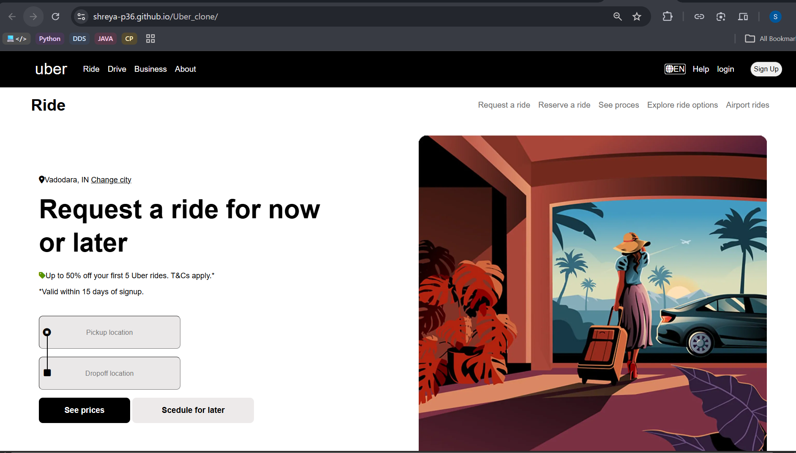
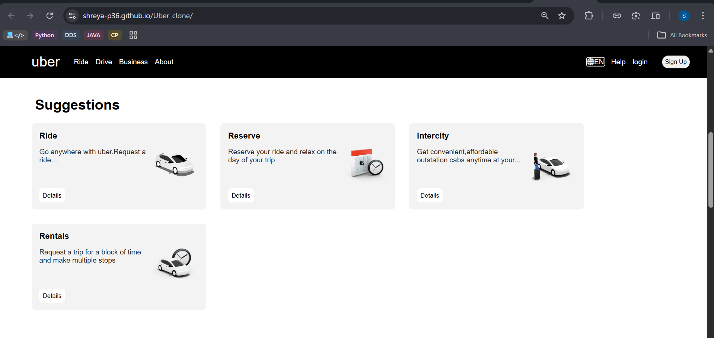
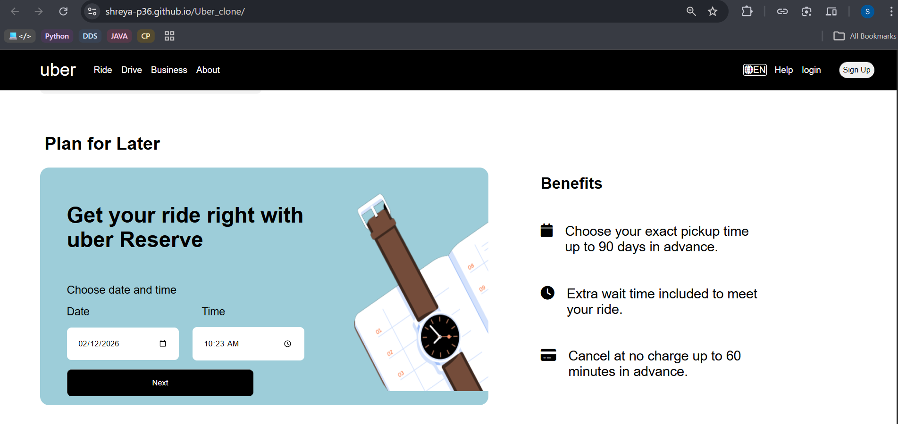
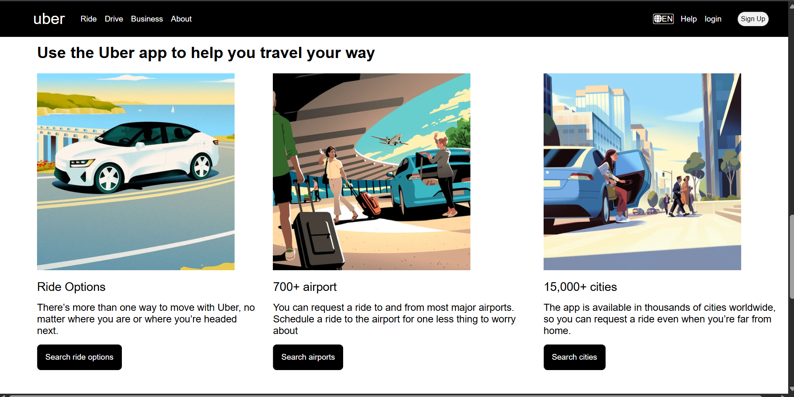
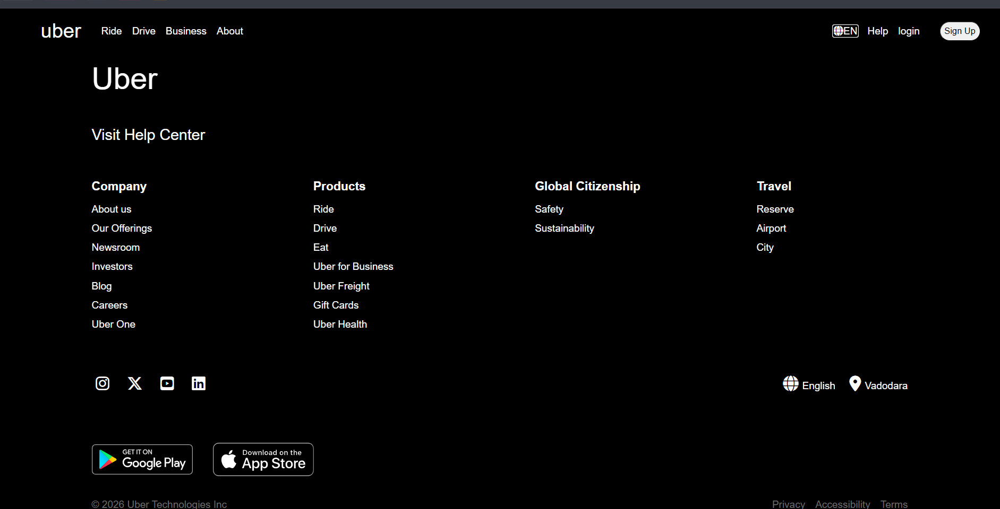

~~Objective: -
Practice real-world UI replication
Improve HTML, CSS, and responsive design skills
Understand how large-scale product websites structure layouts
Learn pixel-accuracy and spacing discipline

Sceenshots : -

🧩 Sections Implemented :- 
Hero / Landing section
Navigation bar
Informational content sections
Footer
(Only selected sections were cloned, not the entire website)

🛠 Tech Stack :- 
HTML
CSS
Flexbox
Media Queries

📱 Responsiveness :- 
Desktop-first design
Responsive adjustments using media queries

What I Learned : -
Writing media queries to make layouts responsive across different screen sizes
Structuring and styling a footer section with proper alignment and spacing
Using Flexbox content arrangement
Maintaining consistent layout hierarchy similar to production websites
Improving section-wise organization for better readability and UI flow
Understanding how large websites manage spacing, alignment, and responsiveness

